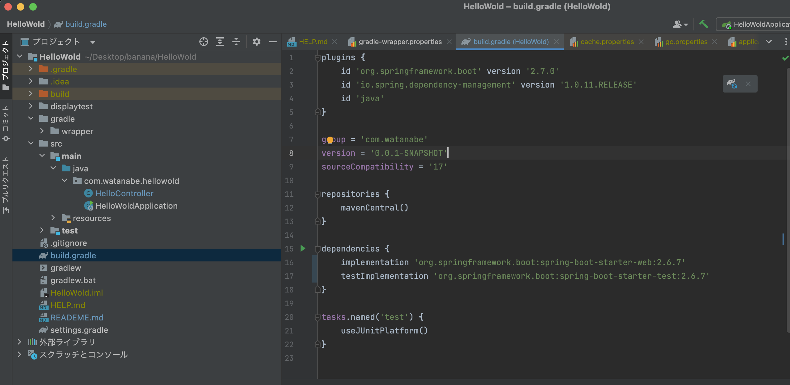
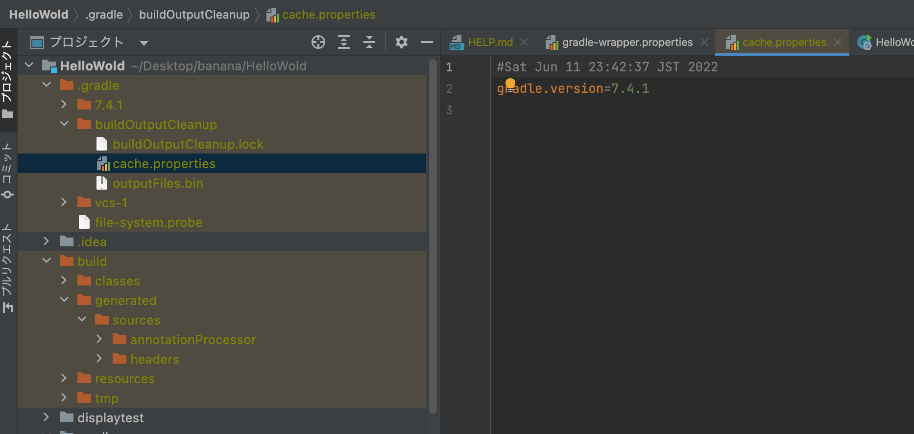
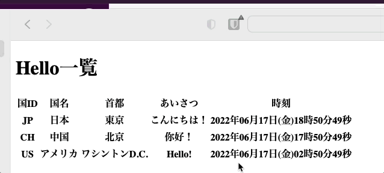

# 課題 6

## 課題内容

SpringBootを使って画面にHelloWorldを表示してみる  

リクエストで受け取った国（japan、us、france、korea）ごとに出すメッセージをかえる  

現在時刻を表示する

## 依存関係

- **Project** Gradle  

- **Language** Java

- **SDK** 17

- **Spring Boot version** 2.70  

- **spring-boot-starter-test** 2.70  

- **spring-boot-starter-web** 2.70  
- 
- **Thymeleaf** 2.70

## 確認方法

  

  

## 概要の説明  
### HelloDomain
**HelloEntity**、**HelloController**で使用するEnumを格納  
今回Listで使用するkey。
### HelloEntity  
**HelloController**のListで使用するコンストラクタやgetterを格納  
今回はJP,CH,USの国名、首都、挨拶、タイムゾーンを設定    
### DateTimeDisplay  
**OffsetDateTime**にて**ZoneId**を使用したタイムゾーンの取得。 
### HelloController  
HelloEntityを引数に取り、Listを作成しその値を**hello.html**に送る。  
パスの値は　**"/hello/list"**  
### HelloRestController  
**"/hello/JPN", "/hello/CST", "/hello/USP"**　など各国ごとのパスの指定。
### hello_list.html  
**Thymeleaf**の機能を使い、**HelloController**で値を受け取った値をテーブル形式で表示。

## 出力結果
